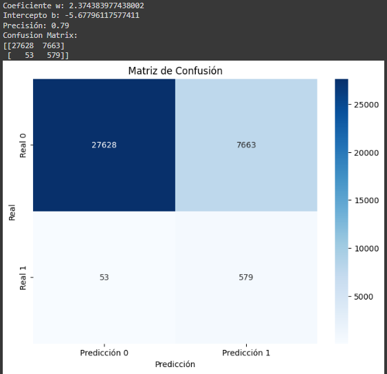
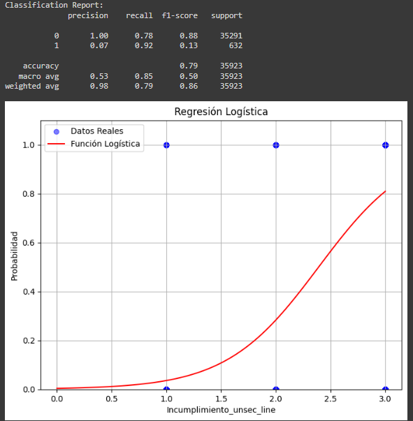
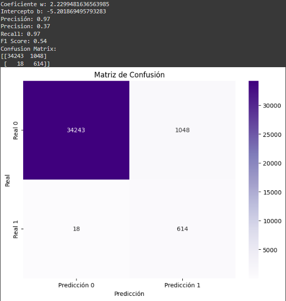
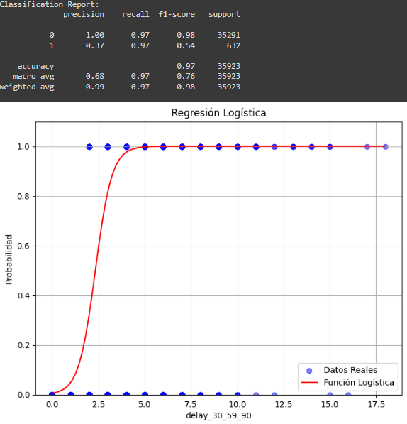

# Proyecto 3.- Riesgo Relativo

> 

Automatizar y optimizar el proceso de análisis crediticio para gestionar eficazmente el riesgo de incumplimiento

### Temas

- [Introducción](#introducción)
- [Herramientas](#herramientas)
- [Procesamiento](#procesamiento)
  - [Limpieza de datos ](#limpieza_de_datos)
  - [Análisis exploratorio](#análisis_exploratorio)
  - [Hipótesis](#hipótesis)
  - [Score de Riesgo](#score_de_riesgo)
  - [Regresión Logistica](#regresion_logistica)
- [Conclusiones](#Conclusiones)
- [Recomendaciones](#Recomendaciones)
- [Recursos](#Recursos)

## Introducción
 El riesgo relativo (RR) es una medida utilizada en epidemiología y estudios de investigación para comparar la incidencia de un resultado o evento entre dos grupos. Aquí está una explicación más detallada:
  * Grupo expuesto: Este grupo está compuesto por personas que han estado expuestas a un factor de riesgo específico. Por ejemplo, si estamos estudiando el riesgo de desarrollar enfermedades cardíacas en       fumadores, el grupo expuesto sería el de los fumadores.
  * Grupo no expuesto: Este grupo está compuesto por personas que no han estado expuestas al factor de riesgo. Siguiendo el mismo ejemplo, el grupo no expuesto sería el de los no fumadores.
    
El riesgo relativo se calcula como la razón de las tasas de incidencia entre estos dos grupos:

  > [!NOTE]
  > 

  * Si el RR es igual a 1, significa que no hay diferencia en la incidencia entre los dos grupos. En otras palabras, la exposición al factor de riesgo no parece afectar la probabilidad de desarrollar la        enfermedad.
  * Si el RR es mayor que 1, indica que el grupo expuesto tiene un mayor riesgo de desarrollar la enfermedad en comparación con el grupo no expuesto. Por ejemplo, si RR = 1.5, significa que el grupo             expuesto tiene un 50% más de riesgo que el grupo no expuesto.
Si el RR es menor que 1, sugiere que el grupo expuesto tiene un menor riesgo de desarrollar la enfermedad en comparación con el grupo no expuesto. Por ejemplo, si RR = 0.8, significa que el grupo expuesto tiene un 20% menos de riesgo que el grupo no expuesto.
En resumen, el riesgo relativo nos ayuda a comprender cómo la exposición a un factor de riesgo afecta la probabilidad de un resultado específico en comparación con un grupo no expuesto. 

### Objetivo
El objetivo del análisis es armar un score crediticio a partir de un análisis de datos y la evaluación del riesgo relativo que pueda clasificar a los solicitantes en diferentes categorías de riesgo basadas en su probabilidad de incumplimiento. Esta clasificación permitirá al banco tomar decisiones informadas sobre a quién otorgar crédito, reduciendo así el riesgo de préstamos no reembolsables. Además, la integración de la métrica existente de pagos atrasados fortalecerá la capacidad del modelo para identificar riesgos, lo que en última instancia contribuirá a la solidez financiera y la eficiencia operativa del banco.

### **Herramientas**
  1. Google BigQuery
  2. Google Colab
  3. Google Looker Studio
  4. Visual Studio

## **Procesamiento**

  ### 1.1 Limpieza de datos 

1.- Tabla Default:
  Nulos:
  + user_id: 0 nulls
  + default_flag: 0 nulls
Duplicados:
  + user_id: 0 
  + default_flag: 0
Outliers:
  + default_flag: 0 Outliers

2.- Tabla Loans_detail:
  Nulos:
    + user_id_nulos: 0 nulls
    + more_90_nulos: 0 nulls
    + using_lines_nulos: 0 nulls
    + numer_times_30_59_nulos: 0 nulls
    + debt_ratio_nulos: o nulls
    + number_times_60_89_nulos: 0 nulls
Duplicados: 0 
Valores fuera del alcance del análisis:
  Se evalúan las variables para detectar la correlación entre:
 
  + number_times_delayed_payment_loan_30_59_days / number_times_delayed_payment_loan_60_89_days : 0.98655 (Esto indica una alta similitud entre ellas.)
  + more_90_days_overdue, number_times_delayed_payment_loan_60_89_days : 0.99217 
  + more_90_days_overdue, number_times_delayed_payment_loan_30_59_day: 0.98291

    > 
    > 

  * Interpretación: Tiene una correlación muy similar con ambas variables de retraso en el pago

Desviación estándar:
  + more_90_days_overdue: 4.1213646684267
  + number_times_delayed_payment_loan_30_59: 4.144020
  + number_times_delayed_payment_loan_60_89_day: 4.105514

    > 
    > 

  * Interpretación: Las tres variables tienen desviaciones estándar similares, lo que sugiere que sus valores están dispersos en torno a sus medias de manera similar.

  Dado que *more_90_days_overdue* tiene una correlación similar con ambas variables de retraso en el pago y su desviación estándar es similar a las otras dos, podríamos considerar eliminarla para evitar     redundancia en nuestro análisis.

Outliers:
  > 
  >

   + Número de outliers en using_lines_not_secured_personal_assets: 177 ya que no contamos con información adicional, no se eliminan ni imputan estos datos.
     
  > 
  >

  Vista outliders:
  > 
  > 

   + Número de outliers en debt_ratio: 7579 Ya que no contamos con información adicional, no se eliminan ni se imputan estos datos.

  > 
   > 

   Vista Outliders:
   > 
   >
     
   + Número de outliers en more_90_days_overdue: 1946
   > 
   >

   Vista Outliders:
   > 
    >

   + Número de outliers en number_times_delayed_payment_loan_30_59_days: 5812 se deciden imputar (eliminar) los valores mayores a 20 (63 user_id)
   > 
   >

   Vista Outliders:
   > 
   >

   + Número de outliers en number_times_delayed_payment_loan_60_89_days: 1865 se deciden imputar (eliminar) los valores mayores a 20 (63 user_id).
   > 
   > 

   Vista Outliders:
   > 
   >
     
  Nuevas Variables:
  + delay-30_59_90: Se realiza la limpieza de los Outliers, así como la suma de las 3 variables de tiempo de retraso para crear esta columna.
  + segmentacion_delay: Segmentación con base en los días de retraso.
  + incumplimiento_debt_ratio: Segmentación para riesgo de incumplimiento de pago en debt_ratio.
      + Debt ratio bajo: Indica que una persona tiene poca deuda en relación con sus ingresos disponibles o activos
        + Mayor capacidad de manejar deuda.
        + Mejor capacidad de obtener crédito adicional.
        + Impacto positivo en la calificación crediticia.
      + Debt_ratio alto: Significa que una persona tiene una cantidad significativa de deuda en comparación con sus ingresos disponibles o activos.
        + Mayor riesgo de incumplimiento.
        + Menor capacidad de endeudamiento adicional.
        + Posible impacto negativo en la calificación crediticia.
          
           Asignando los siguientes valores:
           + Riesgo_alto: Cuando debt_ratio > 60% (0.6)
           + Riesgo_medio: Cuando debt_ratio > 40-60% (0.4- 0.6)
           + Riesgo_bajo: Cuando debt_ratio < 30% (0.3)
             
  + incumplimiento_unsec_line: La segmentación de riesgo se utiliza para clasificar a los clientes en diferentes niveles según su solvencia crediticia. Aquí están los tres niveles comunes:
      + Alto Riesgo: Clientes con una mayor probabilidad de incumplimiento o retraso en los pagos.
      + Medio Riesgo: Clientes con un riesgo moderado, que pueden cumplir con sus obligaciones, pero con cierta incertidumbre.
      + Bajo Riesgo: Clientes con una alta probabilidad de cumplir con sus pagos de manera puntual.
      
          Asignando los siguientes valores:
           + Riesgo_alto: Cuando debt_ratio > 60% (0.6)
           + Riesgo_medio: Cuando debt_ratio > 40-60% (0.4- 0.6)
           + Riesgo_bajo: Cuando debt_ratio < 30% (0.3)

3.- Tabla Loans_Outstanding:

Nulos:
  + loan_id_ 0 nulls
  + user_id: 0 nulls
  + loan_type: 0 nulls
  
  Duplicados:
  + loan_id_ 0
  + user_id: 305335 No se imputan, ni se eliminan, ya que se aprecia que los duplicados son porque los clientes tienen varios tipos de crédito.
  + loan_type: 0

Outliers:
  + loan_id_ 0 
  + user_id: 0 
  + loan_type: 0 

Cambiar tipo de dato:
  + loan_id_ 0 
  + user_id: 0 
  + loan_type: Se realiza la estandarización en minúsculas de la palabra "real estate" así como de la palabra "others".

Nuevas Variables:
  + real_estate_loan_type: Cantidad de préstamos por cliente
  + others_loan_type: Cantidad de préstamos por cliente
  + total_loan_type: Total de préstamos por cliente.

4.- Tabla user_info:

 Nulos:
  + user_id: 0 nulls
  + age: 0 nulls
  + sex: 0 nulls
  + last_mont_salary: 7199 nulls (valor 0)
  + number_dependents: 943 nulls

Duplicados:
  + user_id: 0 
  + age: 0 
  + sex: 0 
  + last_mont_salary: 0 
  + number_dependents: 0

Outliers:
  + age: 10 Outliders se determina eliminar las edades mayores a 96 años
    
     > 
     > 

     Vista Outliders:
     > 
     > 
     
   + number_dependents: 3,230 Outliers al no tener información clara sobre cual seria la cantidad limite de numero de dependientes por user_id se determina dejar los valores tal como estan.
     > 
     >

      Vista Outliders:
     > 
     >
     
   + last_month_salary: 1170 Outliers  se llega a la decisión realizar la imputación de los datos mediante el reemplazo de los valores atípicos con el valor promedio de los dos segmentos (Sueldo bajo)          (Sueldo alto)
     > 
     >

     VistaLast_month_salary desglosados:
     > 
     >

  Nuevas Variables:
  + Generational_group: Segmentación por grupo generacional.
  + birth_year: año de nacimiento.

### 1.2 Análisis exploratorio

1.- Aplicar medidas de tendencia central

 > 
 >

2.- Visualizar la distribución 

 > 
 >

Interpretaciones:

Gráfica Preferencia en usos de crédito:
 + La gráfica muestra que a medida que se incrementa el uso de líneas de crédito no aseguradas contra activos personales, el ratio de deuda tiende a aumentar. Sin embargo, hay una variabilidad significativa, especialmente en los niveles más altos de uso de crédito no asegurado.

 Gráfica de Uso de líneas de crédito no aseguradas:
 +  La gráfica muestra que los usuarios en sus 40s y principios de los 50s tienen los picos más altos en el uso de líneas de crédito no aseguradas. Después de los 50 años, el uso disminuye notablemente. Esto sugiere que las personas en la mediana edad son más propensas a utilizar líneas de crédito no aseguradas.

  Gráfica de Uso de líneas de crédito aseguradas por patrimonio:
   + La gráfica indica que el uso de líneas de crédito aseguradas por patrimonio aumenta progresivamente desde los 20 años, alcanzando su punto máximo en los usuarios de 50-60 años. Después de esta edad, el uso disminuye gradualmente. Esto sugiere que las personas en su edad media y mayores tienen un mayor uso de líneas de crédito aseguradas por patrimonio.
     
 Observaciones generales: Los picos en el uso de crédito no asegurado ocurren a una edad ligeramente menor que los picos en el uso de crédito asegurado. Y las líneas de crédito aseguradas por patrimonio tienden a ser utilizadas por un rango de edad más amplio y tienen un uso máximo más alto comparado con las líneas de crédito no aseguradas.
  
3.- Calcular cuartiles, deciles o percentiles de los grupos de malos pagadores.

Se analizan las variables que podrían ayudarnos a definir como es un cliente mal pagador.

   Age
 > 
 > 

   Last_salary_month
 > 
 >

   Number_dependents
 >  
 >

   Debt_ratio
 > 
 >!

   Using_lines_not_secured_personal_asset
 > 
 >

  Delay_30-59-89
 > 
 >

4.- Calcular la correlación entre variables numéricas continuas.

 > 
 >

 Last_month_salary / age

  Interpretación: 
  Hay una correlación positiva muy baja entre la edad  y el salario del último mes. Esto indica que a medida que la edad aumenta, el salario del último mes tiende a aumentar ligeramente, aunque la relación es muy débil.

 Debt_ratio / age
  Interpretación: 
  Hay una correlación positiva extremadamente baja entre la edad y el ratio de deuda. Esto sugiere que la edad tiene muy poca influencia en el ratio de deuda de una persona.

 Debt_ratio / last_month_salary
  Interpretación:
   Hay una correlación negativa muy baja entre el ratio de deuda (debt_ratio) y el salario del último mes. Esto implica que, a medida que el ratio de deuda aumenta, el salario del último mes tiende a disminuir ligeramente, pero la relación es muy débil.

  Debt_ratio / Using_lines_not_secured_personal_asset
  Interpretación: 
  Hay una correlación positiva extremadamente baja entre el ratio de deuda y el uso de líneas de crédito no aseguradas. Esto indica que el uso de líneas de crédito no aseguradas tiende a aumentar ligeramente con el aumento del ratio de deuda, pero la relación es prácticamente insignificante.

5.- Calcular riesgo relativo

Se analizan las variables para determinar el número de veces que corre el riesgo de suceder el evento (malos pagadores):

  Age
 
 > 
 >

 Interpretación: 
 + Mayor riesgo relativo (20-51 años): Los usuarios en el rango de edad de 20 a 51 años tienen el mayor riesgo relativo, lo que sugiere que esta cohorte es más propensa a incumplir sus pagos.
 + Menor riesgo relativo (51-96 años): Los usuarios en el rango de edad de 52 a 96 años tienen el menor riesgo relativo, indicando que este grupo es el más confiable en términos de pago.
 + Tendencias de edad: Hay una tendencia general a que el riesgo relativo disminuya con la edad.

Last_salary_month

 > 
 >

  Interpretación: 
 + Mayor riesgo relativo: Los usuarios en el rango de salario más bajo tienen el mayor riesgo relativo, lo que sugiere que entre son 3.65 veces más propensos a incumplir sus pagos.
 + Menor riesgo relativo: Los usuarios en el rango de salarios más elevados tienen el menor riesgo relativo, indicando que este grupo es el más confiable en términos de pago pues solo tiene un 39% de   
posibilidades de incumplir en sus pagos.
 + Tendencias Hay una tendencia general a que el riesgo relativo disminuya conforme aumentan los ingresos mensuales del cliente.

Number_dependents

 > 
 >

 Interpretación: 
 + Mayor riesgo relativo: Los usuarios en el rango de dependientes medio (+1) tienen 5.68 veces más probabilidades de incumplir en sus pagos.
 + Menor riesgo relativo: Los usuarios de los cuartiles 1 y 2  indican que no hay riesgo de que ocurra el evento en estos cuartiles, posiblemente porque no hay dependientes en estos grupos.
 + Tendencias Hay una tendencia general a que el riesgo relativo aumente conforme los dependientes.
   
Debt_ratio

 > 
 >

 Interpretación: 
 + Mayor riesgo relativo: Los usuarios del  tercer cuartil presentan el mayor riesgo relativo (1.40) y la tasa de malos pagadores más alta (2.24%). Este cuartil muestra un punto crítico donde el riesgo de incumplimiento es significativamente mayor.
 + Menor riesgo relativo: Los usuarios del cuartil 1 tienen menor riesgo relativo (0.71) de ser malos pagadores, con una tasa de malos pagadores de 1.35%.
 + Tendencias: A medida que el debt_ratio aumenta, tanto la tasa de malos pagadores como el riesgo relativo tienden a aumentar hasta el tercer cuartil. El cuarto cuartil, aunque tiene los ratios de deuda más altos, muestra un riesgo relativo menor (1.09) que el tercer cuartil, lo que sugiere que algunos de los deudores con ratios extremadamente altos pueden tener factores mitigantes no reflejados solo en el debt_ratio.

Using_lines_not_secured_personal_asset

 > 
 >

Interpretación: 
 + Mayor riesgo relativo: Los usuarios del cuartil 4 tienen el mayor riesgo relativo (41.08) y la tasa más alta de malos pagadores (0.06559). El máximo uso de líneas de crédito no aseguradas en este cuartil es extremadamente alto (22,000), lo que sugiere un riesgo significativamente mayor de incumplimiento asociado con altos niveles de endeudamiento no asegura
 + Menor riesgo relativo: Los usuarios de el cuartil 1 presentan el menor riesgo relativo (0.038) y una muy baja tasa de malos pagadores (0.00089). Es el cuartil con el uso mínimo de líneas de crédito no aseguradas, indicando que un bajo nivel de endeudamiento a través de líneas no aseguradas está asociado con un bajo riesgo de incumplimiento.
 + Tendencias: Estos hallazgos sugieren que un mayor uso de líneas de crédito no aseguradas está fuertemente correlacionado con un aumento en el riesgo de incumplimiento. Esto podría indicar que políticas más estrictas en la concesión de crédito no asegurado o una evaluación más detallada del riesgo crediticio podrían ser necesarias para los individuos en los cuartiles superiores de uso.

### 1.3 Hipótesis

Para la validación de hipótesis en el proceso de evaluación del riesgo relativo, se analizarán distintas variables, como el historial de pagos, la deuda total y los ingresos, entre otros.
El objetivo es determinar cómo estas variables influyen en el riesgo de incumplimiento. Este análisis permitirá clasificar a los clientes en diferentes categorías de riesgo.

 + *Los más jóvenes tienen un mayor riesgo de impago:*  Validada: Los individuos más jóvenes (Generación Z- Millennials) tienden a tener balances más  altos y límites de crédito más bajos, lo que puede indicar un  mayor riesgo de impago.
   
 + *Las personas con más cantidad de préstamos activos tienen mayor riesgo de ser malos pagadores.* Si se observa que un mayor número de  prestamos activos está asociado con un mayor número de pagos incumplidos en comparación con los pagos cumplidos.
   
 + *Las personas que han retrasado sus pagos por más de 90 días tienen mayor riesgo de ser malos pagadores.* las personas con retrasos en los pagos tienen un mayor riesgo de ser malos pagadores.
   
 + *Existe una diferencia significativa en el riesgo de ser mal pagador entre los diferentes cuartiles de salario del último mes:* Las personas con salarios más bajos tienen un riesgo mucho mayor de ser mal pagadores en comparación con las personas con salarios más altos (cuarto cuartil).
 
 + *Existe una diferencia significativa en el riesgo de ser mal pagador entre los diferentes cuartiles del número de dependientes* Las personas con 0 dependientes en el primer cuartil y las personas con 1 a 13 dependientes en el cuarto cuartil tienen un riesgo mayor de ser mal pagadores en comparación con aquellos en los otros cuartiles.

 ## Score de Riesgo

 1.- Creación de variables Dummys
 La regresión logística asigna un peso (coeficiente) a cada característica (variable dummy y otras variables). Estos coeficientes indican la importancia de cada característica para predecir la probabilidad de incumplimiento. (0 u 1)

 2.- Cálculo de Score Riesgo

El modelo de regresión logística calcula una probabilidad de incumplimiento para cada registro. Esta probabilidad se convierte en un resultado binario utilizando un umbral (generalmente 0.5). Si la probabilidad es mayor que el umbral, el resultado es 1 (incumplimiento), de lo contrario, es 0 (no incumplimiento).

 > 
 >
  

3.- Matriz de confusión y métricas de precisión.

La matriz de confusión te permite evaluar el rendimiento del modelo comparando las predicciones con los valores reales de default_flag.

> 
>

Resultados Matriz de Confusión:

+ True Positives (TP) = 28,709: El número de casos correctamente predichos como positivos (por ejemplo, mal pagadores que fueron correctamente identificados como mal pagadores).
+ False Positives (FP) = 66: El número de casos incorrectamente predichos como positivos (por ejemplo, buenos pagadores que fueron incorrectamente identificados como mal pagadores).
+ False Negatives (FN) = 6,582: El número de casos incorrectamente predichos como negativos (por ejemplo, mal pagadores que fueron incorrectamente identificados como buenos pagadores).
+ True Negatives (TN) = 566: El número de casos correctamente predichos como negativos (por ejemplo, buenos pagadores que fueron correctamente identificados como buenos pagadores).

Resultados Métricas de Precisión:

+ Accuracy (0.8149375052): La exactitud del modelo es del 81.49%. Esto significa que el modelo predice correctamente el 81.49% de las instancias en el conjunto de prueba, lo cual es bastante sólido.
+ Precision (0.9977063423): La precisión es del 99.77%. Esto indica que el 99.77% de los casos predichos como positivos (mal pagadores) son realmente positivos. La alta precisión sugiere que el modelo es muy eficaz para evitar falsos positivos.
+ Recall (0.8134935253): El recall es del 81.35%. Esto indica que el modelo está capturando el 81.35% de todos los verdaderos positivos (mal pagadores reales). Un recall en este nivel es bastante bueno, lo que sugiere que el modelo identifica correctamente una gran parte de los casos positivos.
+ F1 Score (0.8962320107): El F1 Score es del 89.62%. Esta métrica equilibra la precisión y el recall. Un F1 Score alto indica un buen equilibrio entre estos dos aspectos, lo que sugiere que el modelo es confiable tanto en la identificación correcta de los positivos como en evitar falsos positivos.

## **Regresión Logística**

Examina cómo una variable afecta directamente a otra, analizamos cómo ciertas variables independientes influyen en la probabilidad de un evento específico (la variable dependiente).

Age:

> 
>

> 
>

Interpretación:

* La línea roja indica que la probabilidad de default disminuye con la edad. Es decir, según el modelo, las personas más jóvenes tienen una mayor probabilidad de estar en morosidad en comparación con las personas mayores.

* Los puntos azules representan los valores reales de la variable objetivo para cada edad en el conjunto de datos. La disposición de estos puntos sugiere que, en el conjunto de datos, muchos individuos fueron clasificados como no default (0) independientemente de la edad, aunque el modelo indica una mayor probabilidad de default para los más jóvenes.

* la curva de regresión logística no se ajusta bien a los datos, ya que la mayoría de los puntos están agrupados en 0 o 1, y la curva es bastante suave. Esto podría indicar que la edad no es un buen predictor para la variable default_flag o que otros factores no considerados en este modelo podrían estar influyendo en el resultado.

Last_month_Salary

> 
>

> 
>

Interpretación:

* La línea roja indica que el modelo predice una alta probabilidad de incumplimiento con salarios muy bajos, disminuyendo rápidamente a medida que el salario aumenta.

* Debido a que muchos salarios tienen valores repetidos (como 0, 10, 20), la función logística no se ajusta bien a los datos, resultando en una línea de probabilidad empinada y rápidamente aplanada. Esto indica que el salario del último mes no es un buen predictor de incumplimiento.

Debt Ratio

>  
>

> 
>

Interpretación:
* La mayoría de los datos parecen estar agrupados en valores discretos de Incumplimiento_debt_ratio, y los valores de default_flag están cerca de 0 o 1.
* Derivado de los bajos valores la curva es bastante plana, lo que indica que la variable Incumplimiento_debt_ratio no es un buen predictor del incumplimiento (default_flag).

Using_lines_not_secured_personal_asset

> 
>

> 
>
 
Interpretación:

* La línea roja de la función logística tiene una pendiente positiva, lo que indica que a medida que aumenta el valor de “Incumplimiento_unsec_line”, también aumenta la probabilidad de incumplimiento. 

* Los puntos azules representan los datos observados. Se observa que, para valores bajos de “Incumplimiento_unsec_line”, la mayoría de los puntos están en 0 (sin incumplimiento), mientras que para valores más altos, los puntos tienden a acercarse a 1 (con incumplimiento). 

* La forma de la curva logística sugiere que “Incumplimiento_unsec_line” es un buen predictor del incumplimiento, ya que muestra una relación clara y creciente entre esta variable y la probabilidad de default.

Delay 30-59-90

> 
>

> 
>

Interpretación:

* La gráfica sugiere que delay_30_59_90 es un buen predictor de incumplimiento (default_flag).

* Aquellos con un número de días de retraso mayor a 3 tienen una alta probabilidad de incumplimiento.

* La función logística se ajusta bastante bien a los datos, ya que sigue de cerca la distribución de los puntos reales. Sin embargo, fuera del rango crítico (especialmente a la derecha de la gráfica), la función se estabiliza, indicando que la probabilidad de incumplimiento se mantiene constante para mayores valores de retraso.

### **Conclusiones**
**Modelo de Riesgo Crediticio**

 El modelo está diseñado para optimizar la toma de decisiones en la concesión de créditos, priorizando la precisión en la identificación de clientes con perfiles de alto riesgo.

 1.- Age: Clientes 21-41

 2.- Last Month Salary: Clientes con salarios de 0 a 3,878 USD

 3.-Debt ratio: Clientes con un uso mayor a 36.65%  de credito.

 4.-Ussing lines not secured: Clientes con un uso mayor a 54.65%  de credito.

 5.-Delay 30-59-90: Clientes con retrasos mayores a 1 día.

### **Recomendaciones*
Se emiten las siguientes recomendaciones:

1. Mejorar la recolección de datos (1st):
    * Precisión y Completitud: Garantizar la recolección de datos precisos y completos sobre los clientes. Datos faltantes o incorrectos pueden afectar significativamente la efectividad del modelo.
    * Ampliar el conjunto de variables: Considera la inclusión de más variables que puedan ser relevantes para la predicción del riesgo crediticio, como el historial crediticio, la estabilidad laboral, y otros factores socioeconómicos.

2. Monitoreo del Desempeño (2nd):
    * Evaluación Continua: Implementar un sistema de monitoreo para evaluar el rendimiento del modelo continuamente. Esto permite identificar rápidamente cualquier desviación en el desempeño del modelo.
    * Actualizaciones Periódicas: Realizar ajustes periódicos en el modelo para asegurarte de que sigue siendo relevante y preciso a medida que cambian los datos y las condiciones del mercado.

3. Cumplimiento Normativo (3rd):
    * Regulaciones y Normas: Garantizar que el modelo cumpla con todas las regulaciones y normativas locales e internacionales en materia de privacidad y uso de datos, así como en la evaluación de crédito.
    * Transparencia: Manténer un registro claro y transparente de cómo se utilizan los datos en el modelo y asegúrate de que los clientes estén informados y protegidos.

4. Evaluación de Bias (4th):
    * Mitigación del Sesgo: Evalúar el modelo para identificar cualquier sesgo inherente que pueda existir, especialmente en función de características sensibles como la edad, el género o el origen étnico.
    * Equidad en las Decisiones: Garantizar que el modelo toma decisiones justas y equitativas para todos los clientes, y realiza ajustes si se identifican patrones de discriminación o sesgo.

Estas recomendaciones buscan asegurar que el modelo no solo sea preciso, sino también ético, justo y conforme a las normativas vigentes.

## **Recursos**

### Presentación del Proyecto 
Accede a la presentación del proyecto haciendo clic [aquí](https://drive.google.com/file/d/1GdkslQ3pPk7i1k2rmBQY7mdTkbuySkSC/view?usp=sharing)

### Presentación del Proyecto (Loom)
Accede a la presentación del proyecto en video haciendo clic [aquí](https://www.loom.com/share/4c20f9ee3cc84ed9ba70d407a3001e4a?sid=c3fff1cb-befa-444c-9c47-3d5bd6350082)

### Dashboard 
Accede dashboard en Looker Studio haciendo clic [aquí]([https://lookerstudio.google.com/s/hZ4DBBeUt_0](https://lookerstudio.google.com/reporting/06d7c865-eb81-42b8-8693-1a75653d46ed)).

